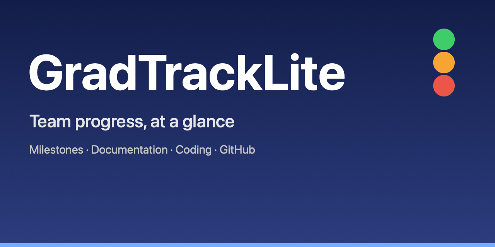
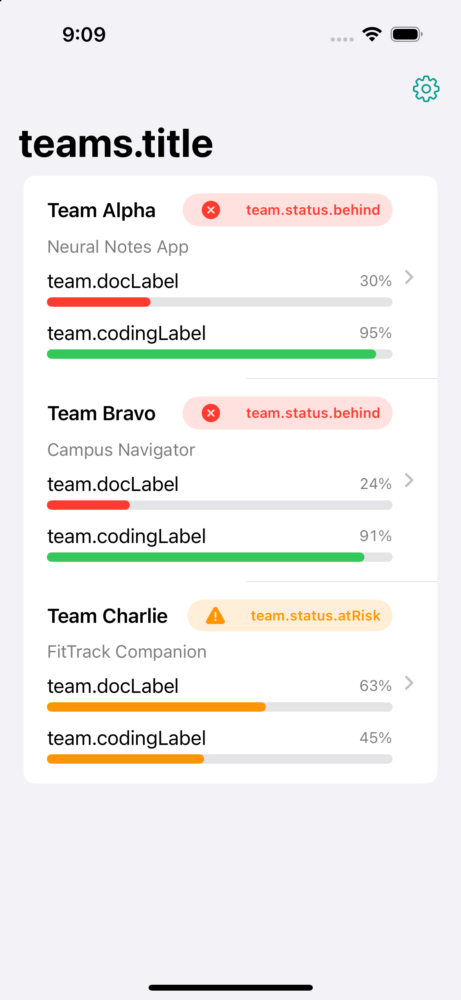

# GradTrackLite

> A lightweight, iOS-first progress tracker for student project teams. GradTrackLite turns a team's milestones, documentation and GitHub activity into two clear scores — *Documentation* and *Coding* — and a single at-a-glance health status: **On track**, **At risk**, or **Behind**.


---


<div align="center">
  
</div>

## Why GradTrackLite

Student teams juggle a proposal, an SRS, a design doc, a final report — plus real development work. GradTrackLite pulls all of that into one dashboard:

- **Milestones** (Proposal, SRS, Design, Final Report) each with a status and an optional grade.
- **A Documentation score** computed from milestone statuses.
- **A Coding score** derived from live GitHub data (issues closed, active weeks, commits).
- **A single team status** that surfaces whether the team is on track or falling behind.

It's deliberately minimal: one screen of teams, one detail screen, one settings screen — no accounts, no servers, no spreadsheets.

## Features

- 📋 **Milestone tracking** — Proposal, SRS, Design, Final Report; each `Not submitted`, `Submitted`, or `Graded` (with a grade).
- 📊 **Progress scoring** — deterministic, unit-tested rules for Documentation and Coding progress.
- 🚦 **Team health** — `On track` / `At risk` / `Behind` from milestones + GitHub activity.
- 🐙 **GitHub integration** — commits-per-week chart, open/closed issues, open/merged PRs, per-member commits, last commit.
- 🔐 **Keychain-backed token** — your GitHub personal access token stays in the Keychain, never on disk or in logs.
- 📦 **SwiftData persistence** — teams, milestones, and cached GitHub progress are stored locally.
- 🔁 **Pull to refresh** — re-sync GitHub data on demand.
- 🌐 **Localized** — English and Arabic (`Localizable.xcstrings`).
- ♿️ **Accessible** — semantic labels on charts, adaptive colors for status.


## Screenshots

<div align="center">
  
</div>

## How the scores work

The progress rules live in `GradTrackLite/Services/ProgressRules.swift` as pure functions, so they're trivial to reason about and fully unit-tested.

**Documentation percent** (average across milestones):

| Status     | Score |
|------------|-------|
| Not submitted | 0 |
| Submitted     | 60 |
| Graded        | `60 + 40 × (grade / 100)` |

**Coding percent**:

- If there are issues: `closed / total × 100`
- If there are no issues: `activeWeeks × 25`

**Team status** is computed in priority order: `Behind`, then `At risk`, then `On track`. A past-due `Not submitted` milestone, a stale last commit, or low activity flags a team accordingly.

## Tech stack

- **Swift 5**, **SwiftUI**, **SwiftData**
- **Swift Charts** for the commits-per-week bar chart
- **URLSession + async/await** for the GitHub REST API
- **Keychain Services** for the optional GitHub token
- **XCTest** for unit tests (24 tests, all passing)

## Getting started

### Requirements

- Xcode 15+ (iOS 17.0+ SDK)
- An iOS 17.0+ simulator or device

### Run it

```bash
git clone https://github.com/drsultan2008/GradTrackLite.git
cd GradTrackLite
open GradTrackLite.xcodeproj
```

Select the **GradTrackLite** scheme, pick a simulator, and press **⌘R**. The app seeds a few sample teams from `mock_blackboard.json` on first launch, then loads live GitHub data.

### GitHub token (optional)

Private repos need a token. Open **Settings → GitHub token** and paste a [personal access token](https://github.com/settings/tokens) with `repo` scope. It's stored in the Keychain. Public repos work without one.

## Usage

1. **Teams** — the home screen lists every team with its Documentation %, Coding %, and a colored status badge.
2. **Team detail** — milestones with status/grade, the commits-per-week chart, issue/PR counts, and per-member commits.
3. **Settings** — enter your GitHub token, edit each team's `owner/repo`, and refresh all data.

Pull-to-refresh on any screen re-syncs GitHub data.

## Project structure

```
GradTrackLite/
├── GradTrackLiteApp.swift       # App entry; SwiftData model container
├── Info.plist
├── Models/
│   ├── Milestone.swift          # SwiftData @Model for a milestone
│   ├── Team.swift               # SwiftData @Model for a team
│   └── Models.swift             # Enums (Title/Status/TeamStatus), GitHub DTOs, CachedProgress
├── Services/
│   ├── ProgressRules.swift      # Pure, testable scoring + status rules
│   ├── GitHubService.swift      # GitHub REST client (commits/issues/PRs)
│   ├── BlackboardService.swift  # Seeding abstraction (mock now)
│   ├── DataLoader.swift         # Seeding, refresh, and loading/error state
│   └── TokenStore.swift         # Keychain-backed token storage
├── Views/
│   ├── TeamsListView.swift      # Teams dashboard + status badges
│   ├── TeamDetailView.swift     # Milestones, chart, GitHub stats
│   ├── SettingsView.swift       # Token + repo editing + refresh
│   └── Components.swift         # Reusable status/progress views
├── Resources/
│   ├── Localizable.xcstrings    # English + Arabic strings
│   └── mock_blackboard.json     # Sample data for first launch
└── Assets.xcassets/
```

## Testing

```bash
xcodebuild -project GradTrackLite.xcodeproj \
  -scheme GradTrackLite \
  -destination 'platform=iOS Simulator,name=iPhone 15' \
  CODE_SIGNING_ALLOWED=NO test
```

Runs 24 unit tests covering the documentation scoring, coding scoring, and team-status priority rules. CI (`.github/workflows/ci.yml`) runs build + tests on every push and pull request.

## Contributing

Contributions are welcome. Please read [CONTRIBUTING.md](CONTRIBUTING.md) first — it covers the workflow, coding style, and how to add tests.

## License

Distributed under the MIT License. See [LICENSE](LICENSE).

## Acknowledgements

Built for a graduate software-engineering course project using SwiftUI, SwiftData, and the GitHub REST API.

---

<sub>Maintained by [drsultan2008](https://github.com/drsultan2008).</sub>
